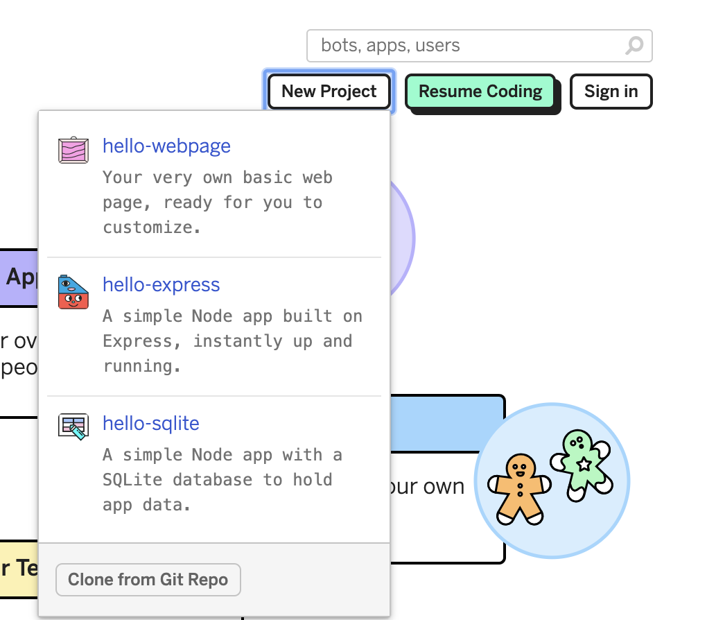
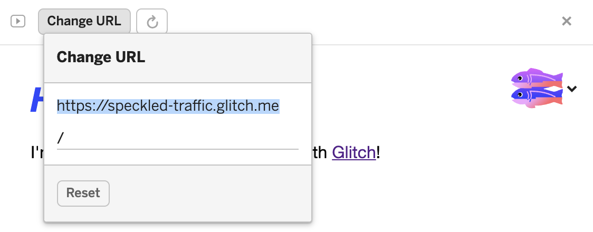
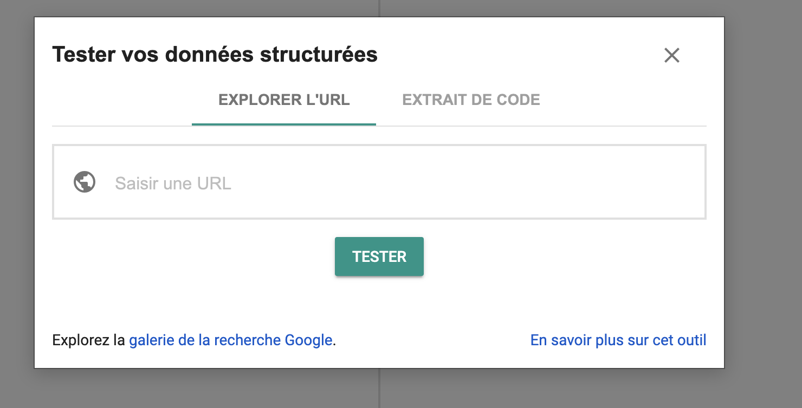

# Add structured data to your web pages


## Let create a web page

GO to [glitch](https://glitch.com/) and create a hello-webpage project as shown below.





## Where to add the structured data in a web page?

The JSON-LD paylod should be inside a &lt;script &gt; element in either the &lt;head&gt; or &lt;body&gt; of the index.html page.

```html
<html>
<head>
...
<script type="application/ld+json">
{

}
</script>
</head>
</html>
```


## Add the scholarly article structured data


```html
<html>
<head>
...
<script type="application/ld+json">
{
    "@context":"http://schema.org",
    "@id": "https://doi.org/10.1016/j.cell.2015.09.029",
    "@type": "ScholarlyArticle",
    "author": "http://your/id/here",
    "datePublished": "2015-10",
    "name": "Reconstruction and Simulation of Neocortical Microcircuitry"
}

</script>
</head>
</html>
```


## Validate the added structured data

Get the web site url as shown in the figure below.



Go to [Google structure data testing tool](https://search.google.com/structured-data/testing-tool?hl=fr) and paste the web page URL as shown below.

 
