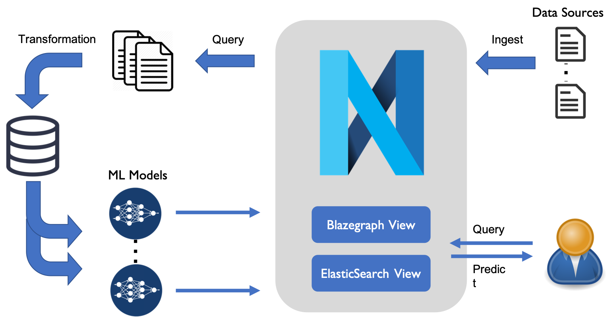

# Building a Data Pipeline for a Content based Recommender System

## Overview

This hands-on tutorial will focus on entity recommendation using knowledge graph embeddings and Blue Brain Nexus. Many entity recommender strategies exist including collaborative filtering, content-based recommendation or combination of the two. This tutorial will only focus on content-based recommendation and put an emphasis on how Blue Brain Nexus can support and orchestrate serving and using knowledge graph embeddings for entity recommendation.

## What you'll build
You will use a Jupyter notebook to build a pipeline to train embeddings for knowledge graph entities and use them for content-based recommendation. You'll follow the next steps:

* Set up a Nexus environment in Python
* Pull data from Nexus
* Prepare the data and ensure they are in a good shape for embeddings
* Train the embeddings model
* Push the embeddings in Nexus
* Recommend similar items using the embeddings and Blue Brain Nexus ElasticSearch view

## What you'll learn

* knowledge graph embeddings
* Blue Brain Nexus data projection and indexing
* ElasticSearch view creation and update in Blue Brain Nexus
* Content-based recommendation using Blue Brain Nexus

## Get the tutorial code

This tutorial code is available:

* on [Google Colab](https://colab.research.google.com/github/BlueBrain/nexus-bbp-domains/blob/docs/src/main/paradox/docs/bluebrainnexustutorialkcni/notebooks/src/main/paradox/docs/bluebrainnexustutorialkcni/notebooks/Building_a_Content_based_Recommender_System_using_Blue_Brain_Nexus.ipynb)
