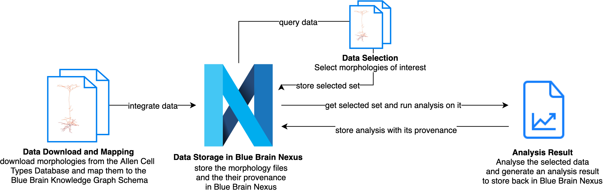

# Building a data pipeline

## Overview

## What you'll build

* A pipeline demonstrating how to: 
    * download data (e.g. morphologies) from a remote source (e.g. [Allen Cell Types Database](https://celltypes.brain-map.org/))
    * register the downloaded data in a knowledge graph within Blue Brain Nexus
    * register the dataset provenance in the knowledge graph
    * build a dataset made of entities of interest (e.g. a set of morphologies from a given species, brain region) and register it in Blue Brain Nexus with an immutable identifier
    * Run analysis on the build dataset (e.g. topological analysis of neuronal morphologies using [Topological Morphology Descriptor](https://github.com/BlueBrain/TMD) )
    * Register the analysis results (plots, figures) in the Knowledge graph and record their provenance
    
  

## What you'll learn

* How to leverage a knowledge graph as part of a data anaylis pipeline to store and manage (meta)data, search for data and record data provenance

## What you'll need

* A Python 3.5 or higher with support of Jupyter notebook

## Get the tutorial code

This tutorial code is available:

* at [Github](https://github.com/BlueBrain/nexus-bbp-domains/blob/docs/src/main/paradox/docs/bluebrainnexustutorialkcni/notebooks/BBPworkshop_datapipeline_nexus.ipynb)
* on [Google Colab](https://colab.research.google.com/github/BlueBrain/nexus-bbp-domains/blob/docs/src/main/paradox/docs/bluebrainnexustutorialkcni/notebooks/BBPworkshop_datapipeline_nexus.ipynb)
