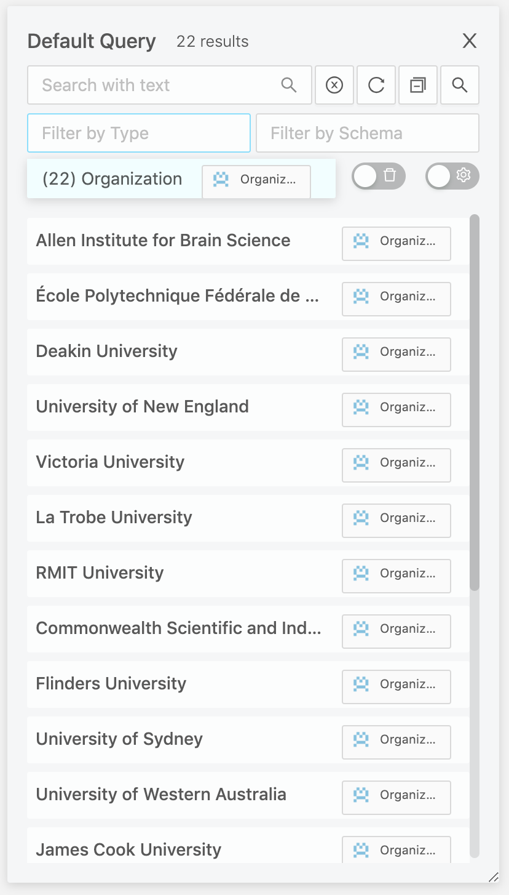
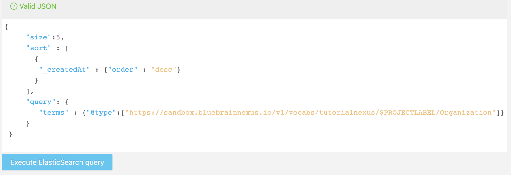

# Quick Start


## Overview

This example-driven tutorial presents 5 steps to get started with Blue Brain Nexus to build and query a simple [knowledge graph](../../knowledge-graph/thinking-in-graph.html).
The goal is to go over some capabilities of Blue Brain Nexus enabling:

* The creation of a project as a protected data space to work with
* An easy ingestion of a dataset
* Querying a dataset to retrieve various information
* Sharing a dataset by making it public

For that we will work with the small version of the [Global Research Identifier Database (GRID) dataset](https://www.grid.ac/) containing a set of:

* institutes (institutes.csv)
* their acronyms (acronyms.csv)
* their addresses (addresses.csv)
* their urls  (links.csv)

An overview of this dataset can be found [here](../dataset/index.html).

@@@ note
* We will be using [Blue Brain Nexus CLI](https://github.com/BlueBrain/nexus-cli), a python client throughout this quick start tutorial.
* This tutorial assumes you've installed and configured the CLI. If not, please follow the [Set up](../setup/index.html) instructions.
@@@

Let's get started.


## Create a project

Projects in BlueBrain Nexus are spaces where data can be:

* **managed**: created, updated, deprecated, validated, secured;
* **accessed**: directly by ids or through various search interfaces;
* **shared**: through fine grain Access Control List.

A **project** is always created within an **organization** just like a git repository is created in a github organization. Organizations can be understood as accounts hosting multiple projects.

### Select an organization

@@@ note
A public organization named **[tutorialnexus](https://sandbox.bluebrainnexus.io/web/tutorialnexus)** is already created for the purpose of this tutorial. All projects will be created under this organization.
@@@

The following command should list the organizations you have access to. The **tutorialnexus** organization should be listed and tagged as non-deprecated in the output.

Command
:   @@snip [list-orgs-cmd.sh](../assets/list-orgs-cmd.sh)

Output
:   @@snip [list-orgs-out.sh](../assets/list-orgs-out.sh)


Let select the **tutorialnexus** organization.

Command
:   @@snip [select-orgs-cmd.sh](../assets/select-orgs-cmd.sh)

Output
:   @@snip [select-orgs-out.sh](../assets/select-orgs-out.sh)


### Create a project

A project is created with a label and within an organization. The label should be made of alphanumerical characters and its length should be between 3 and 32 (it should match the regex: [a-zA-Z0-9-_]{3,32}).

Pick a label (hereafter referred to as $PROJECTLABEL) and create a project using the following command.
It is recommended to use your github username to avoid collision of projects labels within an organization.

Command
:   @@snip [create-project-cmd.sh](../assets/create-project-cmd.sh)

Output
:   @@snip [create-project-out.sh](../assets/create-project-out.sh)

By default, created projects are private meaning that only the project creator (you) has read and write access to it. We'll [see below](#share-data) how to make a project public.

The output of the previous command shows the list of projects you have read access to. The project you just created should be the only one listed at this point. Let select it.

Command
:   @@snip [select-project-cmd.sh](../assets/select-project-cmd.sh)

Output
:   @@snip [select-project-out.sh](../assets/select-project-out.sh)

We are all set to bring some data within the project we just created.

## Ingest data


### Load the dataset

Let first list the files that made the small version of the GRID dataset.

Command
:   @@snip [downloadmovielens-cmd.sh](../assets/downloadmovielens-cmd.sh)

Output
:   @@snip [downloadmovielens-out.sh](../assets/downloadmovielens-out.sh)


The data to be ingested come in 5 csv files (see the output of the above command) containing each a partial description of the organizations. A single command allows
to load the organisations within the institutes.csv file and merge it with links.csv, addresses.csv and acronyms.csv.

```shell
nexus resources create --file institutes.csv --type Organization --format csv \
 --idcolumn grid_id --idnamespace http://www.grid.ac/institutes/ \
 --mergewith links.csv --mergewith addresses.csv --mergewith acronyms.csv \
 --mergeon grid_id \
 --max-connections 4
```


## Access data

### View data in Nexus Web

Nexus is deployed with a developer oriented web application allowing to browse organizations, projects, data and schemas you have access to.
You can go to the address https://sandbox.bluebrainnexus.io/web/tutorialnexus and search for your project and browse the data you just loaded. The following panel should be visible with the loaded organizations. They can be filtered by type and a simple full text search can be performed.




### Query data

Listing is usually not enough to select specific subset of data. Data ingested within each project can be searched through two complementary search interfaces called [views](../../../api/1.0/kg/kg-views-api.md).

View              | Description
------------------|---------------
ElasticSearchView | Exposes data in [ElasticSearch](https://www.elastic.co/products/elasticsearch), a document oriented search engine and provide access to it using the [ElasticSearch query language](https://www.elastic.co/guide/en/elasticsearch/reference/current/search-request-body.html).
SparqlView        | Exposes data as a [graph](../../knowledge-graph/thinking-in-graph.html) and allows to navigate and explore the data using the [W3C Sparql query language](../../knowledge-graph/querying-knowledge-graph.html).

#### Query data using the ElasticSearchView

The ElasticSearchView view is available in Nexus web at the address https://sandbox.bluebrainnexus.io/web/tutorialnexus/$PROJECTLABEL/nxv:defaultElasticSearchIndex/_search.
The following query selects 5 organizations (entities of types Organization) sorted by creation date in descending order. Note that the type is a generated HTTP based URI.

```
{
     "size":5,
     "sort" : [
       {
        "_createdAt" : {"order" : "desc"}
       }
     ],
     "query": {
     	"terms" : {"@type":["https://sandbox.bluebrainnexus.io/v1/vocabs/tutorialnexus/$PROJECTLABEL/Organization"]}
     }
 }

```

Copy and past the query (change $PROJECTLABEL to your own project) in Nexus web as shown in the following figure.




#### Query data using the SparqlView

The SparqlView is available at the address https://sandbox.bluebrainnexus.io/web/tutorialnexus/$PROJECTLABEL/nxv:defaultSparqlIndex/sparql.

The following query selects 5 organizations (entities of types Organization) sorted by creation date in descending order.

```
PREFIX vocab: <https://sandbox.bluebrainnexus.io/v1/vocabs/tutorialnexus/$PROJECTLABEL/>
PREFIX nxv: <https://bluebrain.github.io/nexus/vocabulary/>
Select ?org ?name ?createdAt
 WHERE  {

    ?org a vocab:Organization.
    ?org vocab:name  ?name.
    ?org nxv:createdAt ?createdAt
}
ORDER BY DESC (?createdAt)
LIMIT 5
```

Copy and past the query (change $PROJECTLABEL to your own project) in Nexus web as shown in the following figure.


## Share data

Making a dataset public means granting read permissions to "anonymous" user.

```shell
$ nexus acls make-public
```

To check that the dataset is now public:

* Ask the person next to you to list resources in your project.
* Or create and select another profile named public-tutorial (following the instructions in the [Set up](../setup/index.html).
You should see the that the public-tutorial is selected and its corresponding token column is None.

Output
:   @@snip [select-profile-public-out.sh](../assets/select-profile-public-out.sh)


* Resources in your project should be listed with the command even though you are not authenticated.

Command
:   @@snip [list-res-org-proj-cmd.sh](../assets/list-res-org-proj-cmd.sh)
