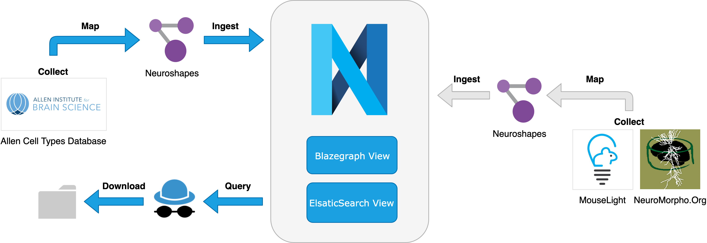

# Ingest Allen Cell Types Database in Nexus

## Overview

## What you'll build

* A pipeline demonstrating how to: 
    * collect data from a remote source: [Allen Cell Types Database](https://celltypes.brain-map.org/)
    * ingest the collected file data in a knowledge graph within Blue Brain Nexus
    * map the collected metadata to the Neuroshapes data model
    * ingest the mapped metadata in a knowledge graph within Blue Brain Nexus
    * find ingested data in the knowledge graph
    * download filtered subsets of data from the knowledge graph
    
  
## What you'll learn

* How to leverage a knowledge graph as part of a data pipeline to ingest and manage (meta)data, search for data and record data provenance

## What you'll need

* Python 3.5 or higher with support of Jupyter notebook

## Get the tutorial code

This tutorial code is available:

* at [Github](https://github.com/BlueBrain/nexus-bbp-domains/blob/docs/src/main/paradox/docs/bluebrainnexustutorialkcni/notebooks/blue_brain_nexus_allencelltypesdb_collect_ingest_find.ipynb)
* on [Google Colab](https://colab.research.google.com/github/BlueBrain/nexus-bbp-domains/blob/docs/src/main/paradox/docs/bluebrainnexustutorialkcni/notebooks/blue_brain_nexus_allencelltypesdb_collect_ingest_find.ipynb)
